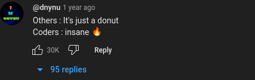
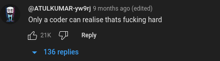
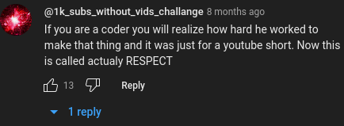
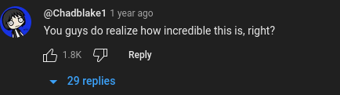
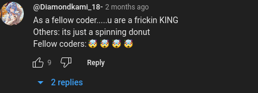
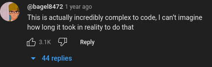
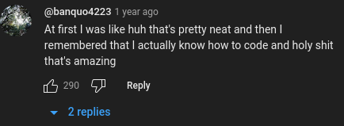
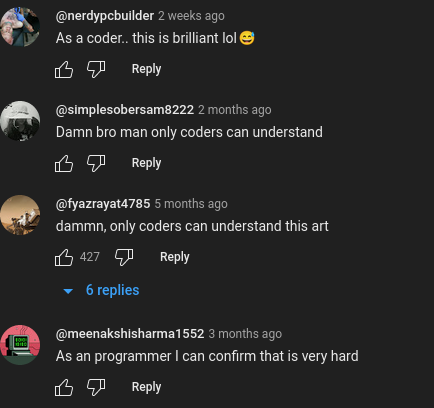

# 3D Spinning ASCII Donut

Basically I saw [this video](https://www.youtube.com/shorts/FIZI3k7mTvA) yesterday and I got annoyed at all script kiddies in the comments gassing him up saying only programmers understand how hard it was, so I did it in a day because I was feeling petty.

<details>
<summary>
Example Comments
</summary>










</details>


## Testimonials:

"Just look at that funky 3D ASCII Donut go! It Spins in real time using the power of open graphics standards!"
> Richard Stallman

"That's honestly so impressive, do you want a job and also all of my money?"
> Bill Gates

"🤤🤤🤤🤤🤤"
> Homer Simpson

"3D Spinning ASCII Donut changed the course of my life. I mean, what more could you want in a program? This was the wake-up call and the inspiration I needed to go back to school and get into coding so I can make my own blockchain startup and never stop posting about it on Rust job listing boards."
> The actual Christian Devil

"Can you please return my calls, I really like your 3D Spinning ASCII Donut and I just want to have a quote in your testimonials so people think we're friends. I promise I won't say anything weird about trans people this time, bro please"
> Elon Musk

"You mean to tell me that the viewport and framebuffer will seamlessly adjust whenever you resize the terminal window so the 3D Spinning ASCII Donut never gets stretched or goes out of frame, and the only reason you only didn't show it off in the preview gif is because asciinema doesn't like resizing terminals? You're a visionary! A coding god! Kenny Florian has a big nose!"
> Chris Rose

## To Run:

```sh
mkdir build
cd build
cmake ..
ninja # or make, or whatever your default cmake output is
cd .. # or ln -s ../shaders .
./build/donut
```

## Dependencies:
- OpenGL 4.3
  - Can be fairly easily made to work with a lower version, but I like explicit layout slots in my shaders so I will not be doing that. Don't bother opening a pull request; I'm already working on a virgin vs chad meme.
- ncurses, therefore either Unix or a MinGW environment on Windows
  - No idea if this compiles on Windows or Mac; I think some OpenGL headers are in different locations or laid out differently?
- GLEW
- GLM